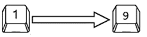
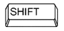
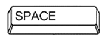
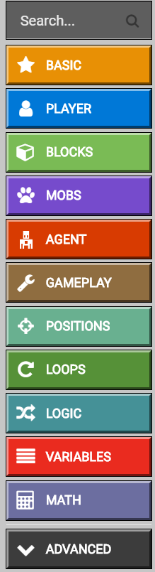

Minecraft – Osnovne karakteristike i komponente
===============================================

Minecraft je nevjerovatno popularna, zabavana i kreativana 3D igrica u kojoj igrači mogu da koriste postojeće alate kako bi izgradili građevine i pravili druge alate. Postoji mnogo načina na koje Minecraft možete iskoristiti da se kod igrača razvije kreativnost i vještina rješavanje problema.

Sve što isprogramirate korištenjem MakeCode će imati trenutni efekat na vaš Minecraft svijet kada pokrenete program. Ovo je odličan način da naučite da programirate jer ćete moći odmah da vidite vizuelni uticaj svog koda. Ova neposredna povratna informacija će vam pomoći u rješavanju problema i omogućiti vam da vidite uticaj kada mijenjate i podešavate vaš kod na svijet igre u Minecraft-u! Zatim, te povratne informacije koje dobijete iz igre se mogu koristiti da biste ponovili i promijenili kod.

U ovom dijelu ćete naučiti kako da se priključite Minecraft svijetu i napišete kod (korištenjem MakeCode) kako biste proširili i kontrolisali Minecraft okruženje.

Instalacija Minecraft: Education Edition
::::::::::::::::::::::::::::::::::::::::

Za instalaciju paketa je potrebno da pratite sljedeće korake:

**Korak 1.**

Preuzmite Minecraft: Education Edition sa linka: https://education.minecraft.net/get-started/download.
Da biste mogli da preuzmete ovaj paket potrebno je da pristupite preko naloga koji je vaša škola otvorila. (Obratite se svom nastavniku za pomoć).

**Korak 2.**

Preuzmite Minecraft: Education Edition na vaš računar.

.. image:: ../_images/_imageMinecraft/23.png
      :align: center

Povezivanje Minecrafta i MakeCode-a.
::::::::::::::::::::::::::::::::::::

**Korak 1.**

Pokreni Minecraft na računaru i prijavi se sa svojim Minecraft: Education Edition nalogom.

.. image:: ../_images/_imageMinecraft/1.png
      :align: center

**Korak 2.**

Kada ste se prijavili, najprije je potrebno da kreirajte svijet, tako što pritisnite dugme Play.

.. image:: ../_images/_imageMinecraft/3.png
      :align: center

Pritisnite dugme ``Create New`` u dijalog prozoru ``Worlds`` u kome se mogu naći neki već kreirani šabloni svjetova. Svoj sopstveni svijet pravite klikom na dugme ``Create New World``.

.. image:: ../_images/_imageMinecraft/5_.png
      :align: center

**Korak 3.**

Otvara se prozor u kome podešavate opcije vašeg svijeta. Za početak ostavite sve kako je podešeno, osim u dijelu ``Cheats`` gdje ćete uključiti (postaviti slajder) ``Activate Cheats`` na ``ON`` kako biste omogućili da u Minecraft-u možemo kodirati preko MakeCode.

.. image:: ../_images/_imageMinecraft/7_.png
      :align: center

**Korak 4.**

Kada ste postavili sve opcije vašeg svijeta, koje naravno možete mijenjati, kliknite na dugme ``Create``.

.. image:: ../_images/_imageMinecraft/8.png
      :align: center

Na ovaj način ste kreirali vaš svijet u kome možete odmah da postavljate svoje blokove.

**Korak 5.**

Da biste u Minecraft-u mogli da programirate (kodirate) otkucajte slovo **„c“**. Prozor **Code Builder** će se pojaviti sa listom aplikacija koje možete da koristite za kodiranje. Izaberite **Microsoft MakeCode**:

.. image:: ../_images/_imageMinecraft/12.png
      :align: center

Početni ekran MakeCode će se pojaviti u prozoru Code Builder.

.. image:: ../_images/_imageMinecraft/13.png
      :align: center

Izaberite ``New Project`` iz liste ``My Projects`` da biste kreirali novi projekat. U slučaju da želite da testirate druge programe, možete izabrati neki od postojećih primjera iz liste Tutorials.

Kada ste kreirali nov projekat u Code Builder otvara se radno okruženje MakeCode-a u kome možete započeti kodiranje:

.. image:: ../_images/_imageMinecraft/14.png
      :align: center

Da biste kreirani kod u Minecraft-u: Education Edition, jednostavno kliknite na dugme |Play|.

.. |Play| image:: ../_images/_imageMinecraft/15.png

Radno okruženje Minecraft-a
:::::::::::::::::::::::::::

.. image:: ../_images/_imageMinecraft/48.png
      :align: center

Kontrola u Minecraft-u vrši se preko tastera na tastaturi koje vam pomažu da se krećete i obavljate određene zadatke.

Lista određenih kontrola u Minecraft-u:

|ESC| - Pauza

|Slika1| - Izbor u Toolbar-u |Tool|

Q – postavljanje objekata (blokova)

W – kretanje naprijed (ako pritisnete dva puta, možete da trčite ili plivate ako ste u vodi)

A – kretanje lijevo

S – kretanje unazad

E – inventar

D – kretanje desno

|Slika2| - Otvara se prozor za chat i zadavanje naredbi

|Slika3| - Lik može da čučne

|Slika4| - Lik može da skoči

.. |ESC| image:: ../_images/_imageMinecraft/16.png

.. |Tool| image:: ../_images/_imageMinecraft/22.png
      :width: 250px
.. |Slika2| image:: ../_images/_imageMinecraft/19.png

Miš koristimo za kontrolu kamere, tačnije preko miša možemo da posmatramo svijet oko sebe. Pritiskom tastera ``F5`` mijenja se ugao kamere.

Radno okruženje MakeCode-a
::::::::::::::::::::::::::

Ovaj online editor daje mogućnost programiranja u JavaScript-u ili u grafičkom (blokovskom) programiranju gdje se naredbe slažu tehnikom „drag and drop“.

U sredini okruženja postavljena je blok kategorija (1) u kome se nalaze grupisane naredbe (blokovi). Sa desne strane nalazi se radna površina (2) na koju se prevlače naredbe i na kojoj se sklapaju programi.

.. image:: ../_images/_imageMinecraft/25_.png
      :align: center

Kategoriju se sastoji od različitih kategorija koje mogu sadržati blokove različitih namjena. Blokovi naredbi podjeljeni su po kategorijama.

U MakeCode, programi su sačinjeni od različitih i međusobno povezanih blokova. Blokovi naredbi su podjeljeni po kategorijama.
Ime kategorije (npr. ``Player``) upućuje te na vrste naredbi (blokova) koje ćeš u toj kategoriji naći. Svi blokovi jedne kategorije su iste boje.

Svaki blok prevlačimo na radnu površinu, a zatim se oni nadovezuju u zavisnosti od programa koji se izrađuje. Kada se klikne desnim klikom miša na blok dobija se padajući kategoriju u kome se nalaze opcije za kreiranje duplikata (``Duplicate``), dodavanje komenatar (``Add Comment``), brisanje bloka (``Delete Block``) i opcije pomoću koje se otvara dio sa informacijama za dodatnu pomoć oko pojedinih blokova (``Help``):

.. image:: ../_images/_imageMinecraft/32.png
      :align: center

Vrijeme je da upotrijebimo blokove i napravimo prvi program u MakeCode-u.

Projekti
::::::::

U narednim tutorijalima upoznat ćemo se sa zanimljivim projektima vezanim za programiranje Minecratf-a na platformi MakeCode. Svi projekti su urađeni postupno – korak po korak tako da ih svako može ponovo uraditi. Opisani su svi postupci izrade projekta, od načina izrade programa do njegovog testiranja.

   .. toctree::
      :maxdepth: 2

      Projektni zadatak - Zdravo svete.rst
      Projektni zadatak - Sadjenje drveca.rst
      Projektni zadatak - Koliko ima stabala.rst
      Projektni zadatak - Stub.rst
      Projektni zadatak - Toplo - Hladno.rst
      Projektni zadatak - Farenhajti.rst
