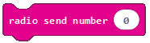
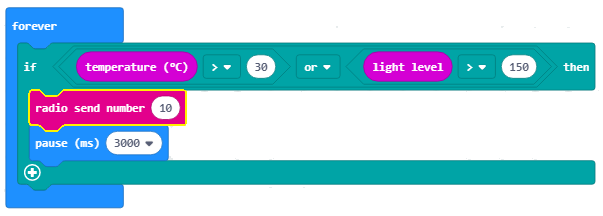

==============================
Projekat zadatak – Čuvar kuća
==============================

Alarmi su uređaji koji putem elektronske mreže komuniciraju sa centralnom kontrolnom jedinicom i šalju signale o eventualnim pokretima i promjenama koje detektuju putem senzora.

Tipičan kućni alarmni sistem sadrži sljedeće komponente:

- Kontrolnu tablu, koja je zapravo centralna kontrolna jedinica alarmnog sistema

- Senzore na vratima, prozorima ili nekim djelovima namještaja

- Senzore pokreta, unutrašnje i spoljašnje

- Veoma bučnu sirenu ili alarm.

Princip rada je veoma jednostavan: alarmni sistemi osiguravaju ulazne tačke, odnosno mjesta koja omogućavaju pristup kući, stanu ili radnom prostoru, senzorima koji komuniciraju sa glavnom kontrolnom jedinicom. Senzori se obično nalaze na vratima ili prozorima, ali i na drugim otvorima koji omogućavaju pristup unutra.

Uređaj Čuvar kuća (Alarm) potrebno je da detektuje pokrete, kao i promjenu temperature i osvjetljenja u prostoriji. Ako se vrata otvore, a poraste temperatura u prostoriji ili se poveća intenzitet svjetlosti uređaj će se oglasiti.

Za izradu uređaja Čuvar kuća (Alarm) potrebno je:

- 3 Micro:bit

- Samoljepljiva traka

- Zvučnik ili slušalice

- Krokodilke

Za izradu uređaja Čuvar kuća (Alarm) potrebno je najprije uraditi fizički uređaj koji se sastoji od Micro:bit-a koji će igrati ulogu senzora koji detektuje pokrete, promjenu temperature i osvjetljenja u prostoriji, i Micro:bit koji će imati ulogu da se oglasi kada nastanu promjene u prostoriji (oko 10 metara od senzora mora da bude postavljen Micro:bit na kome je povezan zvučnik).

.. youtube:: KreiranjeAlarma
  :width: 735
  :height: 415
  :align: center

Sada kada smo napravili uređaj Čuvar kuća (Alarm) potrebno je napraviti programe za svaki od  Micro:bit.

Potrebno je programirati zasebno sva tri Micro:bit-a:

­1. Jedan ima ulogu da detektuje pokrete.
2. Drugi se koristi da detektuje promjenu temperature ili osvjetljenja.
3. Treći se koristi za puštanje zvuka kada se detektuje pokret, promjena temperature ili promjena osvjetljenja u prostoriji.

**Korak 1**

Idite na https://makecode.microbit.org/.

Najprije ćemo programirati Micro:bit pomoću koga ćemo detektovati pokrete.

**Korak 2**

Kreirajte novi projekat.

Želimo sada da isprogramiramo detekciju pokreta, tačnije želimo da pomoću Micro:bit-a registrujemo pokret.

Kada želimo da uspostavimo komunikaciju (da iskoristimo radio komunikaciju) između Micro:bit-ova, svi uključeni Micro:bit-ovi moraju da pripadaju istoj grupi, odnosno da koriste isti ID grupe.

**Korak 3**

Kreiranjem ID grupe se ustvari kreira  prostor u kome će komunicirati uređaji.

Da bismo kreirali ID grupu iz kategorije |Radio| prevlačimo blok |radioset| blok |Basic|. U prostor |ID| unosimo željeni broj za ID grupe. To može biti bilo koji broj. Mi ćemo ostaviti da to bude 1. Na taj način smo kreirali grupu sa ID 1 u kojoj će komunicirati svi Micro:bit-ovi.

.. |Radio| image:: ../_images/_imageMicroBit/s21.png
.. |radioset| image:: ../_images/_imageMicroBit/s22.png
.. |Basic| image:: ../_images/_imageMicroBit/s2.png
.. |ID| image:: ../_images/_imageMicroBit/s23.png

Dio koda kojim se kreira grupa za komunikaciju:

.. image:: ../_images/_imageMicroBit/s24.png
      :align: center

**Korak 4**

U blok |forever|, nalazi se u kategoriji |Basic|, prevuci blok |if..then| iz kategorije |Logic|.

.. |forever| image:: ../_images/_imageMicroBit/s1.png
.. |if..then| image:: ../_images/_imageMicroBit/s3.png
.. |Logic| image:: ../_images/_imageMicroBit/s4.png

U dijelu za uslov |uslov| prevucite blok |uslov1| (nalazi se u kategoriji |Input|).

.. |uslov| image:: ../_images/_imageMicroBit/s5.png
.. |Input| image:: ../_images/_imageMicroBit/s6.png
.. |uslov1| image:: ../_images/_imageMicroBit/s7.png

Iz padajuće liste bloka |uslov1|:

.. image:: ../_images/_imageMicroBit/s8.png
      :align: center

izaberite opciju |shake|. Ova opcija registruje pokrete.

.. |shake| image:: ../_images/_imageMicroBit/s9.png

.. image:: ../_images/_imageMicroBit/s10.png
      :align: center

Na osnovu postavke problema, kada je registrovan pokret (odnosno u našem slučaju kada je uslov ispunjen), Micro:bit-u šalje neku vrijednost korištenjem bloka |radiosend|.

U tekst polje |broj| unosimo broj 5 (može da se unese bilo koja vrijednost). Da bi senzor reagovao, tačnije detektovao pokrete postavit ćemo da je za to potreban određeni vremenski period, neka to bude 3 sekunde (ili 3000 milisekundi). Za to ćemo koristiti blok |time| iz kategorije |Basic|. U polje |vreme| unosimo 3000 ms koje će biti vrijeme za koje senzor odreaguje na promjenu koja se desila.

.. |broj| image:: ../_images/_imageMicroBit/s32.png
.. |vreme| image:: ../_images/_imageMicroBit/s40.png
.. |time| image:: ../_images/_imageMicroBit/s39.png

.. image:: ../_images/_imageMicroBit/s48.png
      :align: center

**Korak 5**

Klikom na dugme |dugme1| ili dugme |dugme2| preuzmite .hex fajl na vaš računar. Prevlačenjem fajla na Micro:bit on je spreman za rad.

.. |dugme1| image:: ../_images/_imageMicroBit/s49.png
.. |dugme2| image:: ../_images/_imageMicroBit/29.png
      :width: 199px

**Korak 6**

Sada je potrebno isprogramirati Micro:bit da detektuje promjenu temperature i intenziteta osvetljenja i da šalje te informacije ka Micro:bit-u koji će se zvučno oglasiti.
Da bi Micro:bit-ovi komunicirali potrebno je da pripadaju istoj ID grupi.

Kreirana je grupu sa ID 1 u kojoj će komunicirati svi Micro:bit-ovi:

.. image:: ../_images/_imageMicroBit/s24.png
      :align: center

U bloku |forever| prevuci blok |if..then| iz kategorije |Logic|. U dijelu za uslov |uslov| treba da prevučemo blokove kojim se definišu uslovi da je temperatura veća od 30, ili da je intenzitet osvjetljenja veći od 150.

Uslovi mogu biti složeni (nastaju povezivanjem prostih uslova).

U našem slučaju prosti uslovi su da je temperatura veća od 30, ili da je intenzitet osvjetljenja veći od 140.

Proste uslove definišemo blokovima |poredjenje|.

U našem slučaju uslove definišemo na sljedeći način:

- temperatura |temperatura| veća od 30: |vece30|.

- intenzitet osvjetljenja |intenzitet| veći od 150: |vece150|.

.. |temperatura| image:: ../_images/_imageMicroBit/s55.png
.. |intenzitet| image:: ../_images/_imageMicroBit/s54.png
.. |vece30| image:: ../_images/_imageMicroBit/s56.png
.. |vece150| image:: ../_images/_imageMicroBit/s57.png

Za povezivanje prostih uslova koristimo logičke operatore (I (engl. AND), ILI (engl. OR), NE (engl. NOT)).

U  MakeCode-u logički operatori su predstavljeni na sljedeći način:

|and| - Povezuje dva uslova, i kao rezultat vraća Tačno samo ako su oba uslova Tačna.

|or| - Povezuje dva uslova, i kao rezultat vraća Tačno ako je bar jedan uslov Tačan.

|not| - Stavlja se ispred jednog uslova, i kao rezultat vraća Tačno u slučaju da uslov nije zadovoljen.

.. |and| image:: ../_images/_imageMicroBit/s50.png
.. |or| image:: ../_images/_imageMicroBit/s51.png
.. |not| image:: ../_images/_imageMicroBit/s52.png

Uslov kojim se provjerava da li je došlo do promjene temperature ili intenziteta osvjetljenja definišemo blokom:

.. image:: ../_images/_imageMicroBit/s58.png
      :align: center

Izgled uslovnog bloka:

Na osnovu postavke zadatka, kada je registrovan promjena temperature ili osvjetljenja, Micro:bit-u šalje neku vrijednost korištenjem bloka |radiosend|. U tekst polje |broj| unosimo broj 10 (može da se unese bilo koja vrijednost).
Da bi senzor reagovao, tačnije detektovao pokrete, postavit ćemo da je za to potreban određeni vremenski period, neka to bude 3 sekunde (ili 3000 milisekundi). Za to ćemo koristiti blok |time| iz kategorije |Basic|. U polje |vreme| unosimo 3000 ms koje će biti vrijeme za koje senzor odreaguje na promjenu koja se desila.

Izgled programa kada je detektovana promjena temperature ili osvjetljenja:

.. image:: ../_images/_imageMicroBit/s59.png
      :align: center

**Korak 7**

Klikom na dugme |dugme11| ili dugme |dugme21| preuzmite .hex fajl na vaš računar. Prevlačenjem fajla na Micro:bit on je spreman za rad.

.. |dugme11| image:: ../_images/_imageMicroBit/s61.png
.. |dugme21| image:: ../_images/_imageMicroBit/29.png
      :width: 199px

**Korak 8**

I na kraju, potrebno je isprogramirati posljednji treći Micro:bit (oglašivač) da kada primi informacije od druga dva Micro:bit-a se oglasi jakim zvukom.

Kreiramo grupu sa ID 1:

.. image:: ../_images/_imageMicroBit/s24.png
      :align: center

Sljedeći korak je da ovaj Micro:bit primi informaciju (u našem slučaju broj) na osnovu koje će da „odreaguje“ tako što će se čuti zvuk. Za to ćemo iz kategorije |Radio| prevući blok:

U njega ćemo prevući blok |if..then|. U dijelu za uslov |uslov| treba da prevučemo uslov kojim se provjerava prijem brojeva (5, 10) od druga dva Micro:bit-a.

Korištenjem znaka |plus| uvodimo još jedan uslov. U grani gdje je uslov |uslov5| i uslov |uslov10| prevlačimo blok |melodija| (iz padajuće liste biramo melodiju ``ringtone``) iz kategorije |Music| kojim se reprodukuje zvuk.
Pored ovog bloka dodajemo i vremenski interval od jedne sekunde.

.. |plus| image:: ../_images/_imageMicroBit/s15.png
.. |uslov5| image:: ../_images/_imageMicroBit/s63.png
.. |uslov10| image:: ../_images/_imageMicroBit/s64.png
.. |melodija| image:: ../_images/_imageMicroBit/s65.png
.. |Music| image:: ../_images/_imageMicroBit/s66.png

Konačan izgled koda:

.. image:: ../_images/_imageMicroBit/s67.png
      :align: center

**Napomena**: Da bi zvuk mogao da se reprodukuje Micro:bit mora da bude povezan sa zvučnicima ili slušalicama na sljedeći način:

.. image:: ../_images/_imageMicroBit/34.png
      :align: center

Možete uporediti rješenje zadatka:

.. youtube:: CuvarKuca
  :width: 735
  :height: 415
  :align: center

**Korak 9**

Klikom na dugme |dugme01| ili dugme |dugme02| preuzmite .hex fajl na vaš računar. Prevlačenjem fajla na Micro:bit on je spreman za rad.

.. |dugme01| image:: ../_images/_imageMicroBit/s62.png
.. |dugme02| image:: ../_images/_imageMicroBit/29.png
      :width: 199px
