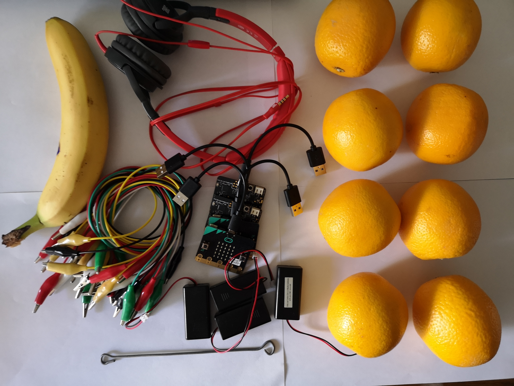

====================================
Projektni zadatak - Raspjevane voćke
====================================

Ton predstavlja pravilno, ravnomjerno treperenje (kretanje) zvučnog izvora.

Ton je zvuk koji ima određenu:

1.	visinu - određuje brzina i broj treperenja u jednoj sekundi. Što je veći broj treperenja u sekundi, ton više zvuči i obrnuto. Ljudsko uho čuje od 16 (najniži ton koji naše uho može da odredi) - 20 000 (najviši ton koji naše uho može da odredi) treperenja/sec.

2.	jačinu - zavisi od veličine treperenja (amplitude) izvora tona. Što je veća amplituda, ton je glasniji. Na jačinu tona utiče i visina tona. Naime, duboki tonovi se čuju znatno slabije od visokih tonova.

3.	trajanje - zavisi od toga koliko dugo treperi izvor tona. Kad se umiri, zvuk prestaje.

4.	boju - zavisi od vrste materijala, oblika i veličine zvučnog izvora koji treperi.

Napravit ćemo muzički instrument uz korištenje Micro:bit-a pomoću koga ćemo odsvirati muzičku ljestvicu.

Muzička ljestvica predstavlja niz od osam uzastopnih tonova (sedam tonova različitog naziva, i osmi ton koji predstavlja ponovljeno ime prvog tona) razvrstanih u oktave. Tonovi u ljestvici se mogu čitati po abecedi i po solmizaciji. Po abecedi tonovi su: c (ce), d (de), e (e), f (ef), g (ge), a (a) i h (ha), a po solmizaciji su: do (ili ut), re, mi, fa, sol (ili so), la, si (ili ti), do.
Micro:bit ćemo koristiti kako bismo proizveli oktavu C, D, E, F, G, A, H.

Za izradu našeg klavira potrebno je:

-	4 micro:bit

-	slušalice

-	krokodilke

-	voćke (8)

-	aluminijumska folija

Za izradu Klavira (Raspjevanih voćki) potrebno je najprije uraditi fizički uređaj koji se sastoji od voćki na kojima ćemo svirati i Micro:bit-ova.

Povezivanje Micro:bit-a sa voćkama (voće koje ima dosta tečnost) i slušalicama:

­Korak 1: Prvi Micro:bit povezujemo tako što uzemljenje (GND) povezujemo sa slušalicama i to pomoću pina (GND) koristeći krokodilke. Slika ispod pokazuje vezu između uzemljenja i Micro:bit (samo za jedan uređaj). GND je uzemljenje koje štiti Micro:bit od strujnog udara. Povezujemo sa žicom koja će imati ulogu uzemljenja. Pored toga potrebno je povezati Micro:bit i slušalice preko PIN0. Povežemo krokodilke na PIN0 i ulaz za slušalice (na njegov vrh). Važno je da se veze na ulazu za slušalice ne dodiruju.

.. image:: ../_images/_imageMicroBit/v3.jpg
      :align: center
      :width: 500px

Korak 2: Kod drugog Micro: bit poveži krokodilku na GND i žicu i spoji je sa bananom (kraj kokodilke ubaciti u bananu). Povezati Micro:bit sa tri narandže na PIN0, PIN1 i PIN2 preko krokodilki.

­Korak 3: Kod trećeg Micro: bit poveži krokodilku na GND i žicu. Povezujemo Micro:bit i narandžu na PIN0 preko krokodilke. Povezati Micro:bit i dve narandže na PIN1 i PIN2 preko krokodilke.

­Korak 4: Kod četvrtog Micro: bit poveži krokodilku na GND i žicu. Povezujemo Micro:bit i narandžu na PIN0 preko krokodilke. Povezati Micro:bit i dve narandže na PIN1 i PIN2 preko krokodilke.

Sada kada smo napravili fizički klavir (Raspjevane voćke) potrebno je napraviti programe za svaki od  Micro:bit-ova.

.. image:: ../_images/_imageMicroBit/v2.jpg
      :align: center
      :width: 500px

.. youtube:: RaspevaneVocke
      :width: 735
      :height: 415
      :align: center

**Programiranje**

Potrebno je programirati zasebno sve Micro:bit-a: da komuniciraju među sobom i da proizvedu zvuk.

**Korak 1**

Idite na https://makecode.microbit.org/.

**Korak 2**

Kreirajte novi projekat.
Sada želimo da isprogramiramo Micro:bit-ove da šalju informacije - odgovarjuće brojeve (za odgovarajuće tonove) kada je pritisnut određeni PIN. Pored toga potrebno je da isprogramiramo Micro:bit-ove da komuniciraju među sobom. Na taj način u zavisnosti od broja (tona) koje Micro:bit-ovi „proizvedu“, tačnije pošalju, Micro:bit prima broj i na slušalicama će se reprodukovati željeni ton.

**Korak 3**

Kada želimo da uspostavimo komunikaciju (da iskoristimo radio komunukaciju) između Micro:bit-ova, svi uključeni Micro:bit-ovi moraju da pripadaju istoj grupi, odnosno da koriste isti ID grupe. Kreiranjem ID grupe, u stvari kreira se prostor u kome će komunicirati uređaji.

Da bismo kreirali ID grupu iz kategorije |Radio| prevlačimo blok |radioset| blok |Basic|. U prostor |ID| unosimo željeni broj za ID grupe. To može biti bilo koji broj. Mi ćemo ostaviti da to bude 1. Na taj način smo kreirali grupu sa ID 1 u kojoj će komunicirati svi Micro:bit-ovi.

.. |Radio| image:: ../_images/_imageMicroBit/s21.png
.. |radioset| image:: ../_images/_imageMicroBit/s22.png
.. |Basic| image:: ../_images/_imageMicroBit/s2.png
.. |ID| image:: ../_images/_imageMicroBit/s23.png

Dio koda kojim se kreira grupa za komunikaciju:

.. image:: ../_images/_imageMicroBit/s24.png
      :align: center

**Korak 4**

Da bi se poslao radio signal drugom uređaju koji će na osnovu toga „odreagovati“ tako da se čuje ton nakon dodirivanja (pritiska) voćke, potrebno je u dio koda za registrovanje događaja (kada se voće dodirne) uvesti blok |radiosend|.

Događaj će biti registrovan kada je pritisnut neki od pinova na Micro:bit-u. Da bismo to postigli uvodimo blok |onpin| iz kategorije |Input|. Iz liste datog bloka biramo pin (P0, P1, P2) koji pokreće događaj slanja broja (tona) koji će biti prikazan.

.. |radiosend| image:: ../_images/_imageMicroBit/s30.png
.. |Input| image:: ../_images/_imageMicroBit/s26.png
.. |onpin| image:: ../_images/_imageMicroBit/s25.png

Potrebno je odrediti način za predstavljanje (čuvanje) vrijednosti željenih tonova (Middle C ili 262, Middle D ili 294, Middle E ili 330, Middle F ili 349, Middle G ili 392, Middle A ili 440, Middle B ili 494). Pored toga potrebno je i definisati vrijednosti za svaku od gore navedenih nota.
Rešenje za ovaj problem jeste uvođenje **promjenljive**.

Promjenljivu možeš da shvatiš kao prostor u memoriji računara, sličan kutiji, u kome se, za vrijeme izvršavanja programa, čuvaju neke međuvrijednosti.
Promjenljive imaju svoja imena. Kada u programu želiš da koristiš vrijednost promjenljive, dovoljno je da navedeš  njeno ime.

Promjenljivu kreiramo tako što, u kategoriji Variables (1), kliknemo na dugme Make a variable (Napravi promjenljivu) (2) i u polje unosimo ime promjenljive (3), u našem slučaju Ton. Klikom na dugme OK (4), kreirana je promjenljiva (5).

.. image:: ../_images/_imageMicroBit/s29.png
      :align: center

Vrednosti promjenljive ``Ton`` će se kretati od 1 do 8.

U slučaju da je pritisnut pin ``P1``, za promjenljivu ``Ton`` postavljamo početnu vrijednost na 1, korištenjem bloka |setTon|.

.. |setTon| image:: ../_images/_imageMicroBit/n1.png

Šaljemo radio signal ka Micro:bit-u korištenjem bloka |radiosend| u kome u dijelu |blok1| prevlačimo promjenljivu ``Ton`` koju želimo da pošaljemo, odnosno dobijamo blok |Ton|.

Dobijamo blok:

.. |blok1| image:: ../_images/_imageMicroBit/s32.png

.. image:: ../_images/_imageMicroBit/s34_.png
      :align: center

Isti postupak uradimo i za pin ``P2``, postavljajući vrijednosti promjenljive ``Ton`` na 2 ako je pritisnut pin ``P2``.

Izgled koda za tipke klavira (C, D):

.. image:: ../_images/_imageMicroBit/s34.png
      :align: center

Konačan izgled programa kojim se šalje informacija o tome koji su pinovi pritisnuti (``P1`` ili ``P2``):

.. image:: ../_images/_imageMicroBit/n7.png
      :align: center

Sledeći korak je da Micro:bit primi informaciju (u našem slučaju broj) na osnovu koje će da „odreaguje“ tako što će se čuti zvuk.

Za to ćemo iz kategorije ``Radio`` prevući blok |onradio|. U zavisnosti od broja (``1`` ili ``2``) koji je primljen ovaj Micro:bit reprodukuje željeni ton.

Za to koristimo blok |ifthen| iz katagorije |Logic|.

.. |onradio| image:: ../_images/_imageMicroBit/30.png
.. |Logic| image:: ../_images/_imageMicroBit/s4.png
.. |ifthen| image:: ../_images/_imageMicroBit/s3.png

U polje uslova prevlačimo bloka |b1| kojim se provjerava da li je pritisnut pin ``P1`` ili ne:

.. |b1| image:: ../_images/_imageMicroBit/n2.png

.. image:: ../_images/_imageMicroBit/n3.png
      :align: center

Ako je pritisnut pin ``P1`` čut će se ton ``C``. Reprodukciju tona postižemo tako što u prevlačimo blok |playton| iz kategorije |Music| kojim se reprodukuje zvuk. U datom bloku iz padajućih lista biramo ton i dužinu istog:

.. |playton| image:: ../_images/_imageMicroBit/31_.png
.. |Music| image:: ../_images/_imageMicroBit/s66.png

.. image:: ../_images/_imageMicroBit/3132.png
      :align: center

Izgled bloka:

.. image:: ../_images/_imageMicroBit/n4.png
      :align: center

U blok |ifthen| dodajemo još jedan uslov (pritisnut pin ``P2``) klikom na dugme |plus|. Ako je pritisnut pin ``P2`` reprodukovat će se ton ``D``.

.. |plus| image:: ../_images/_imageMicroBit/s15.png

Izgled koda:

.. image:: ../_images/_imageMicroBit/n5.png
      :align: center

**Napomena**: Da bi zvuk mogao da se reprodukuje, Micro:bit mora da bude povezan sa zvučnicima ili slušalicama na sledeći način.

.. image:: ../_images/_imageMicroBit/34.png
      :align: center

Konačan izgled programa za reprodukciju tonova ``C`` i ``D``:

.. image:: ../_images/_imageMicroBit/n6.png
      :align: center

Klikom na dugme |dugme1| ili dugme |dugme2| preuzmite .hex fajl na vaš računar. Prevlačenjem fajla na Micro:bit on je spreman za rad.

.. |dugme1| image:: ../_images/_imageMicroBit/s36.png
.. |dugme2| image:: ../_images/_imageMicroBit/29.png
      :width: 199px

Rukom držimo bananu, a drugu ruku koristimo za sviranje po voćkama.

Na isti način potrebno je isprogramirati preostala dva Micro:bit-a za tonove Middle E ili 330,F ili 349, Middle G ili 392, Middle A ili 440, Middle B ili 494.

Konačan kod programa za Micro:bit preko koga se šalje informacija o tome koji su pinovi pritisnuti, kako bi se na osnovu toga reprodukovali tonovi ``E``, ``F`` i ``G``:

.. image:: ../_images/_imageMicroBit/n8.png
      :align: center

Konačan kod programa za Micro:bit preko koga se šalje informacija o tome koji su pinovi pritisnuti, kako bi se na osnovu toga reprodukovali tonovi ``A``, ``H`` i ``C``:

.. image:: ../_images/_imageMicroBit/n9.png
      :align: center

Nakon ovoga potrebno je dopuniti kod na Micro:bit-u koji će biti "oglašivač" zvuka:

.. image:: ../_images/_imageMicroBit/n10.png
      :align: center

.. youtube:: RaspeveneVockeKod
      :width: 735
      :height: 415
      :align: center

Kada smo povezali sve voćkice i prebacili kodove, možemo da odsviramo neku lijepu pjesmu na našem voćnom klaviru.
