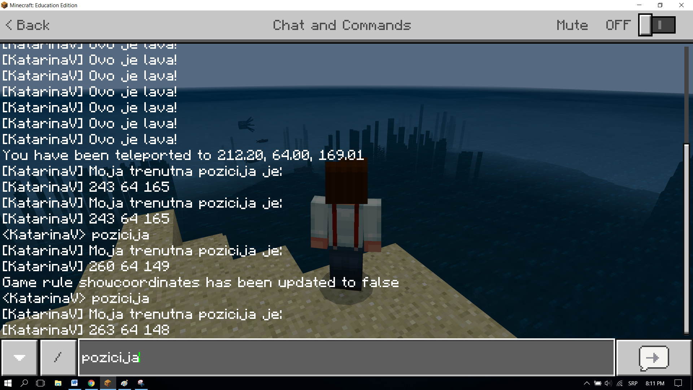
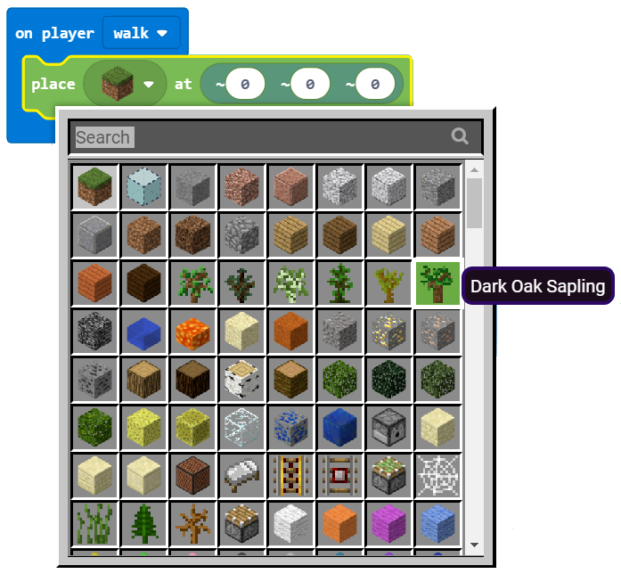
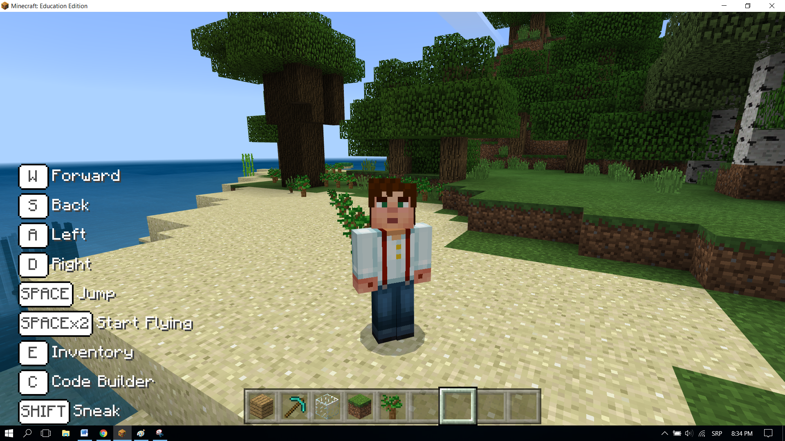

Projektni zadatak - Sadjenje drveca
===================================

Događaji su pojave, koje su najčešće rezultat nečega što korisnik uradi (klik mišem, klik na tastaturi, drag and drop….). Događaj izaziva neku reakciju. Događaj u računarstvu je neka akcija koju detektuje (uradi) računar.  Naprimjer, kada kliknemo mišem – otvara se neka aplikacija, kada kiša počne da pada – ljudi otvaraju kišobran.
U programiranju, event handler je dio programa (funkcija) koja se aktivira kao posljedica nekog dogadjaja. U Makecode-u event handler je blok koji obično počinje rečju **on**:

.. image:: ../_images/_imageMinecraft/31.png
      :align: center

Upotrebit ćemo događaj, kako bismo simulirali sađenje drveća duž Minecratf svijeta i prikazivanje trenutne pozicije lika u Minecratf svijetu navođenjem naredbe **pozicija**.

**Faza 1.**

**Razmišljanje o problemu:** Kretanjem lika po svijetu dešava se interakcija sa svijetom, sadi se drvo. Kretanjem po svijetu sadi se drvo po svijetu. Slanjem poruke (preko četa) predstavlja se trenutna pozicija lika u svijetu.

**Faza 2**

Pokreni ``Code Builder`` (klikom na taster ``C``) i otvorit će se editor prozor u kome je moguće redati blokove.

Da bismo pokrenuli čet, tačnije pokrenuli događaj koji unošenjem reči pozicija predstavlja trenutnu poziciju lika u Minecraft svijetu prevlačimo u prostor za kodiranje blok |onchat| iz kategorije |Basic|, u čije tekstualno polje unosimo riječ **pozicija**.

.. |onchat| image:: ../_images/_imageMinecraft/40.png
              :width: 250px

.. |Basic| image:: ../_images/_imageMinecraft/40_.png

U okviru ovog bloka treba da prevučemo blokove kojima će biti izgovorena trenutna pozicija. Za izgovaranje bilo koje poruke (npr. Moja trenutna pozicija je:) koristimo blok |say| iz kategorije |Player|.

Pozicija lika (igrača) čuva se u bloku |position| iz kategorije |Player|. Kako poziciju lika u svijetu želimo da prikažemo u četu, koristimo za to blok |string| kategorije |Pozicija|. Umesto opcije ``position`` na njeno mesto prevlačimo blok |position|:

.. |say| image:: ../_images/_imageMinecraft/27.png
.. |Player| image:: ../_images/_imageMinecraft/27_.png
.. |position| image:: ../_images/_imageMinecraft/42_.png
.. |string| image:: ../_images/_imageMinecraft/41_.png
.. |Pozicija| image:: ../_images/_imageMinecraft/0.png

.. image:: ../_images/_imageMinecraft/41.png
      :align: center
      :width: 350px

Testirajmo ovaj deo koda, klikom na dugme |Play|.

Nakon testiranja dobijamo ono što smo i želeli, kada korisnik pritiskom na taster ``T`` otvori chat i unese poruku **pozicija**, prikazuje se trenutna pozicija lika u svetu.

.. |Play| image:: ../_images/_imageMinecraft/15.png
          :width: 40px

.. image:: ../_images/_imageMinecraft/42.png
          :align: center

Sada je potrebno da kreiramo događaj kojim će lik svojim kretanjem posaditi stabla u Minecraft svijetu. Ovo postižemo blokom |walk| iz čije padajuće liste biramo opciju ``walk``:

.. |walk| image:: ../_images/_imageMinecraft/1_.png

.. image:: ../_images/_imageMinecraft/44.png
          :align: center

I na kraju u okviru ovog bloka postavljamo blok |place| iz kategorije |Blocks| koji koristimo za postavljanje (u našem slučaju sađenje) drveta. U tom bloku iz padajuće liste biramo blok koji predstavlja drvo:

.. |place| image:: ../_images/_imageMinecraft/45.png
              :width: 350px

.. |Blocks| image:: ../_images/_imageMinecraft/33_.png

U dijelu bloka ``at`` u kome se definiše pozicija bloka koji postavljamo u svijetu, ostavit ćemo da su sve tri koordinate na vrijednostima |nula|. Time će se drva postavljati u istoj ravni u kojoj se nalazi i lik.

Nakon svih izmjena program za prikaz pozdravne poruke izgleda kao na slici ispod:

.. |nula| image:: ../_images/_imageMinecraft/47.png

.. image:: ../_images/_imageMinecraft/49.png
          :align: center

**Faza 3**

Testiranje programa.
Klikom na dugme |Play| .

Nakon testiranja, možemo da zaključimo da program radi upravo ono što želimo. Lik pri svom kretanju sadi drveće.
