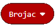
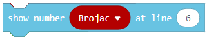
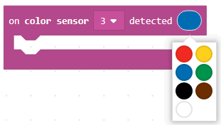

Projektni zadatak - Srednje dugme
=================================

Promjenljiva čuva neku vrijednost koju kasnije možemo da koristimo u programu.

Promjenljive mogu biti:

•	Numerička (čuva broj)

•	Logička (čuva logičke vrijednosti tačno / netačno)

•	Tekst (čuva tekst… „Zdravo“)

Promjenljivu možemo da shvatimo kao prostor u memoriji računara, sličan kutiji, u kome se, za vrijeme izvršavanja programa, čuvaju neke međuvrijednosti. Promjenljive imaju svoja imena. Kada u programu želiš da koristiš vrijednost promjenljive, dovoljno je da navedeš  njeno ime.

Promjenljivu kreiraš tako što, u kategoriji Variables (1), klikneš na dugme Make a variable (Napravi promjenljivu) (2) i u polje uneseš ime promjenljive (3). Klikom na dugme OK (4), kreirana je promjenljiva.

.. image:: ../_images/_imageEV3/42.png
      :align: center

Promjenljive ćemo da demonstriramo kreiranjem programa koji prikazuje koliko je korisnik puta pritisnuo srednje dugme na briku?

Kreirajmo promjenljivu |Brojac|. Postavimo početnu vrijednost brojača na 0, korištenjem bloka |setBrojac|.
Ovaj blok prevučemo u blok |Start|. U okviru ovog bloka prikazujemo i vrijednost brojača na samom početku na ekranu EV3 brika, korištenjem bloka |show|.

.. |setBrojac| image:: ../_images/_imageEV3/70.png
.. |Start| image:: ../_images/_imageEV3/8.png

Izgled koda:

.. image:: ../_images/_imageEV3/74.png
      :align: center

Na osnovu postavke zadatka potrebno je da se registruje pritisak korisnika na srednje dugme na briku, to ćemo postići korištenjem bloka:

.. image:: ../_images/_imageEV3/78.png
      :align: center

Kada se registruje pritisak srednjeg dugmeta na briku, potrebno je povećati vrednost brojača za 1. To ćemo uraditi pomoću bloka |change| iz kategorije |Variable|. Za prikaz nove vrednosti promjenljive Brojač koristimo blok |show|.

.. |change| image:: ../_images/_imageEV3/79.png
.. |Variable| image:: ../_images/_imageEV3/80.png

Izgled koda:

.. image:: ../_images/_imageEV3/75.png
      :align: center

Izgled konačnog koda:

.. image:: ../_images/_imageEV3/76.png
      :align: center

.. youtube:: BrojanjePritiska
      :width: 735
      :height: 415
      :align: center

Priključite EV3 Brick na računar pomoću USB kabla i klikom na dugme |dugme1| preuzmite .uf2 fajl na vaš računar. Prevlačenjem fajla na EV3 on je spreman za rad.

.. |dugme1| image:: ../_images/_imageEV3/download.png
              :width: 199px

Simulacija:

.. image:: ../_images/_imageEV3/78_.png
      :align: center

Upotreba promjenljive demonstrirat ćemo i kroz još jedan primjer kreiranja programa koji prebrojava preko koliko crnih linija je prešao Lego robot.

Kreirajmo promjenljivu |Brojac|. Postavimo početnu vrijednost brojača na 0, korištenjem bloka |setBrojac|.
Ovaj blok prevučemo u blok |Start|. U okviru ovog bloka prikazujemo i vrijednost brojača na samom početku na ekranu EV3 brika, korištenjem bloka |show|.
U dati blok prevlačimo i blok |pravo| kojim ćemo obezbjediti da se robot kreće beskonačno.

.. |pravo| image:: ../_images/_imageEV3/6.png

Izgled koda:

.. image:: ../_images/_imageEV3/81_.png
      :align: center

Na osnovu postavke zadatka potrebno je da senzor registruje crnu boju, to ćemo postići korištenjem bloka u čijoj padajućoj listi biramo crnu boju:

Kada se senzor registruje crnu boju, potrebno je uvečati vrijednost brojača za 1. To ćemo uraditi pomoću bloka |change| iz kategorije |Variable|. Za prikaz nove vrijednosti promjenljive Brojač koristimo blok |show|.

Izgled koda:

.. image:: ../_images/_imageEV3/82_.png
      :align: center

Izgled konačnog koda:

.. image:: ../_images/_imageEV3/81.png
      :align: center

.. youtube:: BrojanjeLinija
      :width: 735
      :height: 415
      :align: center

Priključite EV3 Brick na računar pomoću USB kabla i klikom na dugme |dugme1| preuzmite .uf2 fajl na vaš računar. Prevlačenjem fajla na EV3 on je spreman za rad.
