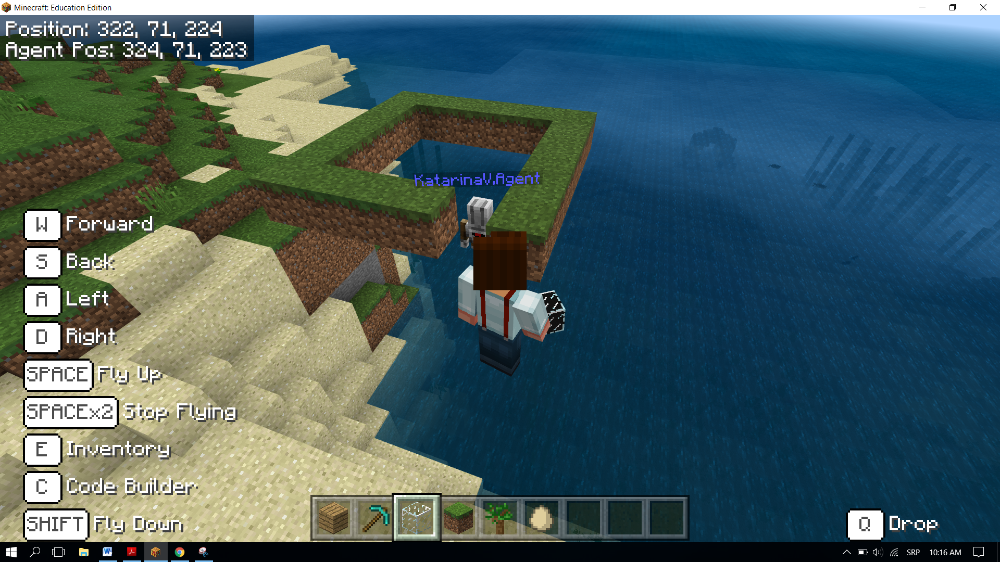
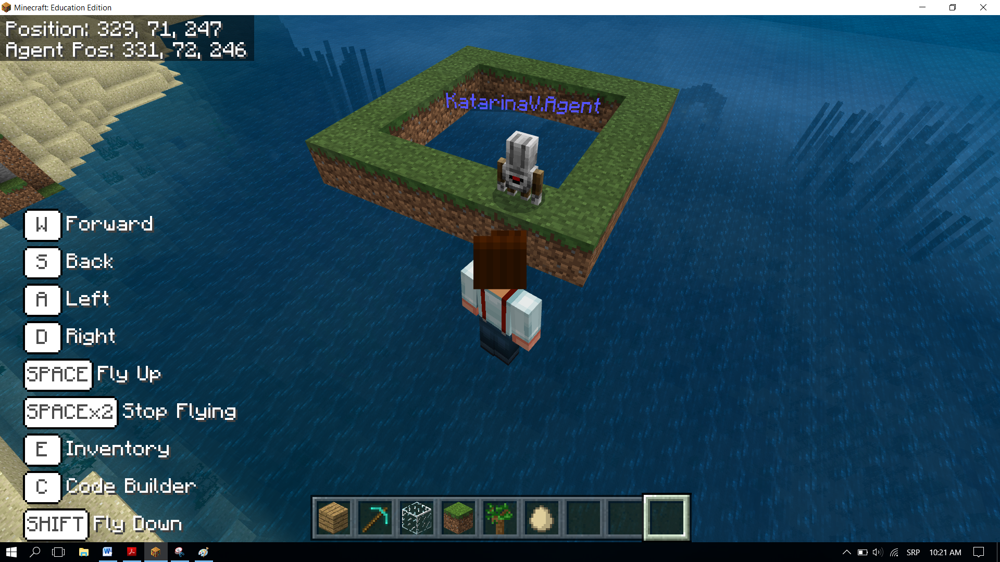

Projektni zadatak - Stub
========================

Slično kao i u prirodi (promjena godišnjih doba, kruženje vode u prirodi, dan i noć, plima i oseka,...), i u programiranju je moguće pojedine korake ponoviti više puta. Kao i u prirodi, u programiranju je, za rješavanje pojedinih zadataka, neophodno da se neki dijelovi programa izvrše više puta. Za takve programe kažemo da sadrže ponavljanja, koje nazivamo **ciklusi**.

Ponavljanje ćemo demonstirati kreiranjem stuba kvadratnog oblika, čija je osnova kvadrat sa stranicama dužine 5 blokova, a visina 10.
U Minecraft-u za izvršavanje određenih radnji, kao što su sadnja i žetva, miniranje, sječa stabala i gradnja objekata, može se koristiti i **agenta**. Blokovi vezani za rad sa agentom nalaze se u kategoriji |Agent|:

.. |Agent| image:: ../_images/_imageMinecraft/s2.png
              :width: 100px

.. image:: ../_images/_imageMinecraft/s5.png
      :align: center

**Faza 1.**

Razmišljanje o problemu: Kretanje naprijed za 5 blokova i skretanjem na lijevo i desno (pod uglom od 90 stepeni) kreira se kvadratna osnova. Kretanje po z osi omogućava izradu kule od 10 blokova.

**Faza 2**

Pokreni ``Code Builder`` (klikom na taster ``C``) i otvorit će se editor prozor u kome je moguće redati blokove.

Ovaj problem ćemo podijeliti u tri dijela:

- postavljamo agenta na određenu poziciju u svijetu i opremamo ga određenim alatima za izradu objekata,

- kreiranje kvadratne osnove stuba,

- kreiranje stupa po vertikali.

Da bismo postavili agenta na željeno mjesto koristimo blok |chat|. Unošenje riječi **dođi** postaje okidač za postavljanje agenda na željeno mjesto. Za postavljanje agenta na željeno mesto koristimo blok |teleport| iz kategorije |Agent|. Agenta ćemo postaviti na poziciju našeg lika (igrača) pomjeren za dva blok (koraka) na levo. Za to ćemo koristiti promjenljivu **pozicija** koje čuvaju trenutnu vrijednost pozicije lika (igrača).

.. |chat| image:: ../_images/_imageMinecraft/s7.png
.. |teleport| image:: ../_images/_imageMinecraft/s6.png
              :width: 450px

Kreiramo promjenljivu **pozicija** u kategoriji ``Variables``:

.. image:: ../_images/_imageMinecraft/61.png
      :align: center

Na početku vrijednost promjenljive **pozicije** je trenutni položaj lika u svijetu pomjeren za 2 bloka u lijevo.
Postavljanje početne vrijednosti ćemo definisati blokom |start|. To znači da svaki put kada se pokrene program Minecraft postavlja vrijednost pozicije na željeno mjesto (agent je pomjeren za dva bloka ulijevo od lika (igrača)), i moguće je započeti konstrukciju kvadratne osnove stuba.

Iz kategorije ``Variables`` prevlačimo blok |set|, u koji prevlačimo blok kojim dobijamo trenutnu poziciju igrača pomjerenu za 2 bloka ulijevo.

.. |set| image:: ../_images/_imageMinecraft/s8.png

.. |start| image:: ../_images/_imageMinecraft/28.png
          :width: 150px

.. |Position| image:: ../_images/_imageMinecraft/0.png
            :width: 100px

Ovo postižemo na sljedeći način, korištenjem bloka:

.. image:: ../_images/_imageMinecraft/62.png
      :align: center

iz kategorije |Position|.

U gornji dio bloka prevlačimo blok |world| koji daje trenutnu poziciju lika (igrača) iz kategorije |Player|. U donjem dijelu bloka na poziciji x koordinate unosimo broj 2.

.. |world| image:: ../_images/_imageMinecraft/28.png

.. |Player| image:: ../_images/_imageMinecraft/42_.png
            :width: 150px

Izgled ``on start`` bloka:

.. image:: ../_images/_imageMinecraft/63.png
      :align: center

Da bismo postavili agenta na željeno mjesto koristimo blok agent |teleport| iz kategorije |Agent|. U prvi argument bloka prevlačimo promjenljivu **pozicija**, a u drugi iz liste biramo **East (positive X)**.

Izgled koda:

.. image:: ../_images/_imageMinecraft/65.png
      :align: center

**Faza 3.**

Testiramo program, klikom na dugme |Play|:.

.. |Play| image:: ../_images/_imageMinecraft/15.png
          :width: 40px

.. image:: ../_images/_imageMinecraft/64.png
          :align: center

Da bi agent mogao da postavlja blokove koje želimo moramo da obezbjedimo njegov inventar sa predmetima koji su mu potrebni za gradnju stuba. Za to koristimo blok |setagent| iz kategorije |Agent|:

.. |setagent| image:: ../_images/_imageMinecraft/s14.png
          :width: 350px

.. image:: ../_images/_imageMinecraft/70.png
          :align: center

**Važno:** Inventar, otvara se klikom na taster ``E``, igrač koristi za upravljanje predmetima koje poseduje (nosi). Sastoji se iz slotova od 1 do 9 u koje može da „čuva“ predmete koji su mu potrebni za kreiranje različitih objekata.
Sada treba kreirati kvadratnu osnovu stuba. Da bi agent mogao da kreira kvadratnu osnovu, potreban je neki „okidač“ za taj događaj. Za to ćemo koristiti čet i reč kvadrat.

Da bismo postavili blokove u kvadratni oblik sa dužinom od 5 blokova koristimo blok |repeat| iz kategorije |Loops|.

.. |repeat| image:: ../_images/_imageMinecraft/s10.png
.. |Loops| image:: ../_images/_imageMinecraft/2_.png
          :width: 100px

Kvadrat je geometrijska figura sastavljena od četiri stranice jednake dužine, pri čemu su naspramne stranice paralelne, a uglovi između susjednih stranica su 90o. Kvadrat ima četiri stranice, tako da u bloku ponavljanja unesemo broj ``4``:

.. image:: ../_images/_imageMinecraft/66.png
          :align: center

Da bi agent postavljao blokove prilikom kretanja po svetu potrebno je da koristimo blok |placeagent| iz kategorije |Agent|.

Da bi mogao da izvrši tu radnju u datom bloku je potrebno postaviti drugi argument bloka na ``true``:

.. |placeagent| image:: ../_images/_imageMinecraft/s11.png

.. image:: ../_images/_imageMinecraft/67.png
          :align: center

Dužinu stranice od 5 blokova definišemo blokom |move| iz kategorije |Agent|:

.. |move| image:: ../_images/_imageMinecraft/s12.png

.. image:: ../_images/_imageMinecraft/68.png
          :align: center

Kako su uglovi kvadrata pod pravim uglom, to obezbjeđujemo korištenjem bloka |turn| iz kategorije |Agent|:

.. |turn| image:: ../_images/_imageMinecraft/s13.png

.. image:: ../_images/_imageMinecraft/69.png
          :align: center

Testiranje programa. Klikom na dugme |Play|.

Nakon testiranja može se uočiti da agent nije konstruisao cijeli pun kvadrat.

Da bismo to postigli potrebno je da pomjerimo agenta. To postižemo uvođenjem bloka |move| i iz padajuće liste izborom opcije ``up``. Agenta pomjeramo za jedan blok pa postavljamo vrednost trećeg parametra na ``1``:

.. image:: ../_images/_imageMinecraft/73.png
          :align: center

Sada ponovo testiramo program i dobijamo kvadrat:

Na osnovu gornjeg koda vidimo da agent nije na poziciji za blok iznad početne pozicije. Da bismo agenta postavili na željeno mjesto uvodimo dva bloka |turn| i |move|:

.. image:: ../_images/_imageMinecraft/74.png
          :align: center

Testiranjem programa možemo da primjetimo da agent po završetku kretanja ostavlja blok. To ne želimo da se desi. Zbog toga uvodimo još dva bloka kojim se agent postavlja bez bloka na poziciji za kreiranje zida:

.. image:: ../_images/_imageMinecraft/75.png
          :align: center

Ostaje nam sada da isprogramiramo kreiranje stuba visine 10 blokova.

To postižemo uvođenjem nove petlje u koju će biti prevučena već kreirana petlja (kojom se kreiran kvadrat). Uvodimo blok |repeat| i postavljamo vrednost brojača na ``10``:

Postavljanje jedne petlje unutar tijela druge petlje zove se **ugnježdavanje**.

.. image:: ../_images/_imageMinecraft/77.png
          :align: center

Konačan izgled koda kojim kreiramo kulu visine 10 blokova, sa osnovom kvadrata 5x5:

.. image:: ../_images/_imageMinecraft/78.png
          :align: center

**Faza 3**

Testiranje programa.
Klikom na dugme |Play| .

.. image:: ../_images/_imageMinecraft/76.png
          :align: center

Na ovaj način je kreiran stub visine 10 blokova i širine 5x5.
