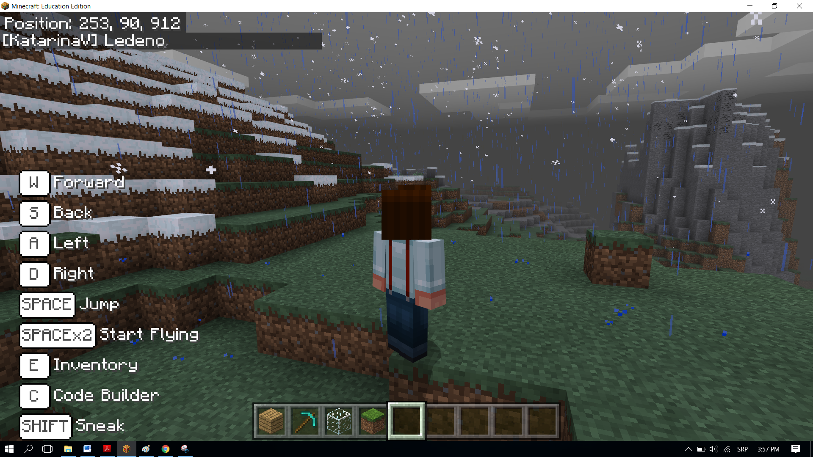

Projektni zadatak - Toplo - Hladno
==================================

Isto kao i ti, i programi u MakeCode-u mogu da donose odluke. Do sada, sve programe koje smo pisali, bili su linijski programi, tačnije programi koji se izvršavaju redom naredbu po naredbu do kraja programa.
Za razliku od ovakvih programa, gdje se svaki korak, odnosno svaka naredba, izvršava samo jedanput, u algoritmima odlučivanja, tačnije razgranatim (uslovnim) algoritmima neke naredbe će se izvršiti, a neke ne, u zavisnosti od ispunjenosti uslova.

Demonstrirat ćemo ovaj koncept programiranja kroz igru Toplo - Hladno. Na osnovu pozicije lika prikazuje se poruka koliko je on udaljen od objekta postavljenog u svetu.  Ako je blizu, izgovoriće se reč Toplo, ako je daleko od predmeta biće izgovoreno Hladno. Ako je lik (igrač) jako blizu objektu, biće izogoveno Vrelo, a ako je jako daleko Ledeno.

**Faza 1.**

**Razmišljanje o problemu:** Za određivanje udaljednosti objekta od lika (igrača) potrebno je da izračunamo rastojanje između njih, i da na osnovu tih vrednosti dobijemo željenu poruku.

**Faza 2**

Pokreni ``Code Builder`` (klikom na taster ``C``) i otvorit će se editor prozor u kome je moguće redati blokove.

Na početku u bloku on start potrebno je definisati i postaviti objekat u svijet. Postavit ćemo ga tako da vrijednost koordinate X ima nasumičnu vrijednost iz intervala 0 do 600, a ostale dvije koordinate imaju vrijednost Y i Z koordinata igrača.

Da bismo to uradili potrebno je da kreiramo promjenljive ``X, Y, Z`` (čuvaju koordinate položaja objakta) i ``Blok`` (čuva objekat). Kreiranim promjenljivima dodeljijemo početne vrijednosti.

U bloku |start| definišemo položaj i vrstu objakta prevlačenjem blokova na sljedeći način:

- definišemo koordinatu x pomoću promjenljive ``X`` koja će imati nasumičnu vrijednost iz intervala od 0 do 600, to postižemo korištenjem bloka |random| iz kategorije |Math|.

- definišemo koordinatu y pomoću promjenljive ``Y`` koja će imati vrijednost y koordinate položaja lika u svijetu. To postižemo korištenjem bloka |getY| iz kategorije |Positions|, u koji umesto promjenljive **position** postavljamo promjenljivu ``Y``, i bloka |world| iz kategorije |Player|.

- definišemo koordinatu z pomoću promjenljive ``Z`` koja će imati vrijednost z koordinate položaja lika u svijetu. To postižemo korištenjem bloka |getZ| iz kategorije |Positions|, u koji umesto promjenljive **position** postavljamo promjenljivu ``Z``, i bloka |world| iz kategorije |Player|.

- definišemo objekat koji će biti postavljen u svijetu. To postižemo korištenjem bloka |blok| iz kategorije |Blocks|.

.. |start| image:: ../_images/_imageMinecraft/28.png
              :width: 150px

.. |random| image:: ../_images/_imageMinecraft/s15.png

.. |world| image:: ../_images/_imageMinecraft/42_.png

.. |Math| image:: ../_images/_imageMinecraft/s16.png
              :width: 100px

.. |getY| image:: ../_images/_imageMinecraft/s17.png

.. |getZ| image:: ../_images/_imageMinecraft/s18.png

.. |Player| image:: ../_images/_imageMinecraft/27_.png
              :width: 100px

.. |Positions| image:: ../_images/_imageMinecraft/0.png
              :width: 100px

.. |Blocks| image:: ../_images/_imageMinecraft/33_.png
              :width: 100px

.. |blok| image:: ../_images/_imageMinecraft/79.png
              :width: 80px

Izgled koda nakon definisanja promjenljivih:

.. image:: ../_images/_imageMinecraft/80.png
      :align: center

Kada su definisane koordinate i objekat koji će biti postavljen potrebno je prevući blok kojim će taj objekat biti fizički postavljen u svijet.
Za to korisitmo blok |place| iz kategorije |Blocks|. Ovaj blok ima dva argumenta, od kojih u prvi argument postvaljamo promjenljivu |b1|, a u drugi postavljamo koordinate |X|, |Y| i |Z| za definisanje položaja objekta korištenjem bloka |b2| iz kategorije |Positions|.

.. |place| image:: ../_images/_imageMinecraft/s19.png

.. |b1| image:: ../_images/_imageMinecraft/s20.png

.. |X| image:: ../_images/_imageMinecraft/s21.png

.. |Y| image:: ../_images/_imageMinecraft/s22.png

.. |Z| image:: ../_images/_imageMinecraft/s23.png

.. |b2| image:: ../_images/_imageMinecraft/82.png

Izmjenjeni kod ima sledeći izgled:

.. image:: ../_images/_imageMinecraft/81.png
      :align: center

Na ovaj način smo pozicionirali objekat u Minecraft svijet. Ako želimo da vidimo koje su njegove koordinate možemo iskoristiti blok |say|. Za prikazivanje možemo koristiti blok |join| iz podkategorije |Text| kategorije |Advanced|.

.. |say| image:: ../_images/_imageMinecraft/27.png

.. |join| image:: ../_images/_imageMinecraft/s26.png

.. |Text| image:: ../_images/_imageMinecraft/s25.png
            :width: 100px

.. |Advanced| image:: ../_images/_imageMinecraft/s24.png
            :width: 100px

Dodavanjem ovog bloka program ima sljedeći izgled:

.. image:: ../_images/_imageMinecraft/83.png
      :align: center

Sljedeći korak je da u bloku |chat| prevućemo blokove pomoću kojih ćemo odrediti rastojanje između postavljenog objekta u svijetu i lika (igrača). To postižemo definisanjem promjenljivih koje će čuvati poziciju lika (igrača), to jest, one čuvaju x, y i z koordinate lika. Pojedinačne koordinate dobijamo korištenjem bloka |world| i bloka |getof|.

.. |chat| image:: ../_images/_imageMinecraft/s27.png
.. |getof| image:: ../_images/_imageMinecraft/s28.png

Kreiramo promjenljive **X1, Y1** i **Z1** i dodjeljujemo im vrijednosti koordinata položaja lika:

.. image:: ../_images/_imageMinecraft/84.png
      :align: center

Da bismo izračunali rastojanje između lika i objekta potrebno je da iskoristimo formulu koja se koristi i u matematici za određivanje rastojanja u 3D između dvije tačke A (x1, y1, z1) i B(x2, y2, z2):

.. image:: ../_images/_imageMinecraft/s29.png
      :align: center

Kreiramo promjenljivu **rastojanje**, i dodjeljujemo joj vrijednost koja se dobija korištenjem formule za izračunavanje rastojanja dve tačke.

U MakeCode-u matematičke operacije su predstavljene u kategoriji |Math|. Jednostvnim redanjem odgovarajućih blokova (``+``, ``-``, i kvadrat ``**``, kao i kvadratni korijen) formiramo gornju formulu:

.. image:: ../_images/_imageMinecraft/85.png
      :align: center

Dopunjeni kod izgleda ovako:

.. image:: ../_images/_imageMinecraft/86.png
      :align: center

Sada kada imamo vrijednost promjenljive **rastojanje**, možemo da završimo našu igru Toplo-Hladno.

Na osnovu rastojanja lika (igrača) od objekta Minecraft obavještava lik (igrača) gde je objekat kratkim porukama kao što su **Toplo**, ako je objekat blizu, **Hladno**, ako je predmeta daleko. Ako je lik (igrač) jako blizu objektu, bit će izogoveno **Vrelo**, a ako je jako daleko **Ledeno**.

Na osnovu postavke zadatka imamo da:

- Ako je objekat udaljen više od 100 blokova od lika (igrača), treba da se izgovori Ledeno.
- U suprotnom ako je objekat udaljen više od 50 blokova od lika (igrača), treba da se izgovori Hladno.
- U suprotnom ako je objekat udaljen više od 25 blokova od lika (igrača), treba da se izgovori Toplo.
- U suprotnom ako je objekat udaljen više od 12 blokova od lika (igrača), treba da se izgovori Vrelo.
- U suprotnom ako je objekat kod objekta (rastojanje jednako nuli), treba da se izgovori Pronađen.

Za ovo ćemo koristi blok |ifthen| i operatore poređenja (> i =) iz kategorije |Logic|. Grane dodajemo klikom na +.
Prevlačenjem ovih blokova dobijamo sledeći izgled koda:

.. image:: ../_images/_imageMinecraft/88.png
      :align: center

.. |ifthen| image:: ../_images/_imageMinecraft/s32.png
.. |Logic| image:: ../_images/_imageMinecraft/s31.png

Konačan izgled programa za igricu Toplo - Hladno:

.. image:: ../_images/_imageMinecraft/89.png
      :align: center

**Faza 3**

Testiranje programa.
Klikom na dugme |Play| .

.. |Play| image:: ../_images/_imageMinecraft/15.png
          :width: 40px

Pokrećemo čet klikom na taster T na tastaturi, u unosimo riječ gdje, koja predstavlja „okidač“ za startovanje igrice.

.. image:: ../_images/_imageMinecraft/90.png
      :align: center

