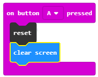

==========================
Projektni zadatak   - Žica
==========================

Probleme sa motorikom (usporenom reakcijom ili nespretnošću za obavljanje neke aktivnosti) srećemo skoro svakodnevno. Dosta poslova sadašnjosti zahtjevaju mirnu ruku. Tako naprimjer, arhitekte, zavarivači, zubari i hirurzi moraju da imaju „mirnu“ ruku kako bi njihov rad bio što uspješniji. Posebno je izražen problem sa motorikom kod ruke koja nije dominantna.

Istraživanja pokazuju da u svijetu 96% ljudi koristi desnu ruku (desnoruko je). Kod većine ovih ljudi lijeva ruka je potpuno zanemarena i sa njom veoma malo preciznih radnji mogu da urade.

Jedan od načina da se ovaj problem prevaziđe jeste uređaj Žica uz pomoć koje osoba vežba svoju motoriku, tako što od uređaja dobija povratnu informaciju o uspješnosti izvršavanja zadatka. Pomoću ovog uređaja svako može da vežba koncentraciju i motoriku ruke. U zavisnosti od povratne informacije korisnik može da utvrdi da li je spretan ili ima problem sa motorikom pa mora više da vježba.

Za izradu uređaja Žica potrebno je:

•	4 Micro:bit
•	Krokodilke
•	Žice različitih dužina
•	Drvena podloga ili stirodur
•	Zvučnik ili slušalice
•	Štipaljka (kukica)

Za izradu Žice potrebno je najprije uraditi fizički uređaj koji se sastoji od žice na kojoj ćemo vježbati svoju motoriku, drvene (ili neke druge) podloge i Micro:bit-ova.

.. image:: ../_images/_imageMicroBit/z4.jpg
      :align: center
      :width: 500px

.. youtube:: Izradauredjajazica
      :width: 735
      :height: 415
      :align: center

**Postupak povezivanja Micro:bit-ova**

Sada kada smo se upoznali sa osnovnim komponentama i karakteristikama Micro:bit, možemo nastaviti dalje sa konstrukcijom uređaja Žica. Na konstrukciju sada treba da povežemo Micro:bit-ove korištenjem krokodilki.
Prvi Micro:bit povezujemo tako što uzemljenje (GND) povezujemo sa žicom pomoću krokodilki.
Slika ispod pokazuje vezu između uzemljenja i Micro:bit (samo za jedan uređaj).

.. image:: ../_images/_imageMicroBit/z3.jpg
      :align: center
      :width: 500px

Pored toga potrebno je povezati Micro:bit sa dijelom uređaja kojim se proverava motorika (kukica).
Sada kada smo napravili uređaj Žica potrebno je napraviti programe za svaki od  Micro:bit.

.. image:: ../_images/_imageMicroBit/z5.jpg
      :align: center
      :width: 500px

.. youtube:: PovezivanjeuredjajaZica
      :width: 735
      :height: 415
      :align: center

**Programiranje**

Potrebno je programirati zasebno sva četiri Micro:bit-a:
­
1. Jedan ima ulogu detektovanja i brojanja grešaka koje korisnik napravi
2. ­Drugi se koristi da se preko njega pokrene vrijeme
3. ­Treći mjeri vrijeme
4. ­Četvrti se koristi za puštanje zvuka kada korisnik napravi grešku.

**Korak 1**

Idite na https://makecode.microbit.org/.

**Korak 2**

Kreirajte novi projekat.
Želimo sada da isprogramiramo detekciju greške, tačnije želimo da pomoću Micro:bit-a registrujemo kada kukica dodirne glavnu žicu.
Na osnovu napravljenog fizičkog uređaja Žica, možemo zaključiti da je pin ``P0`` „okidač“ svih događaja.

Kako je pin ``P0`` vezan pomoću krokodilki za kukicu dodirom glavne žice detektuje se greška i na Micro:bit-u treba da se pojavi krstić (programiramo detekciju greške).

**Korak 3**

Izaberi iz kategorije |Input| blok |press| i iz padajuće liste izaberite pin ``P0``.

.. |Input| image:: ../_images/_imageMicroBit/s6.png
.. |press| image:: ../_images/_imageMicroBit/3.png

Ovaj blok će nam biti „okidač“ vizuelnog prikazivanja greške.

**Korak 4**

Sada je potrebno dodati blok za prikaz krstića na ekranu koji će se pojaviti kada korisnik pomoću kukice dotakne glavnu žicu.
Izaberite |Basic| i blok |leds|.

.. |Basic| image:: ../_images/_imageMicroBit/s2.png
.. |leds| image:: ../_images/_imageMicroBit/s12.png

Izgled koda i simulator greške:

.. image:: ../_images/_imageMicroBit/4_5.png
      :align: center

U kodu ćemo dodati blok za pauzu kojim osiguravamo pravovremeno odazivanje sistema (uređaja Žica).
Izaberite kategoriju |Basic| i blok |Pause| u kome postavljate vrijeme u milisekundama (1000 milisekundi = 1 sekunda).

.. |Pause| image:: ../_images/_imageMicroBit/s39.png

Izgled koda:

.. image:: ../_images/_imageMicroBit/7.png
      :align: center

**Korak 5**

Gornji dio koda samo prikazuje detekciju greške koja nastaje kada kukica dotakne glavnu žicu.

Sada ćemo dodati dio kojim ćemo brojati koliko puta je korisnik napravio grešku. Da bi ovaj zahtjev mogao da bude ispunjen, moramo da pronađemo način da čuvamo i po potrebi mijenjamo vrijednost brojača grešaka koje korisnik pravi.
Rješenje za ovaj problem jeste uvođenje **promjenljive**.

Promjenljivu možeš da shvatiš kao prostor u memoriji računara, sličan kutiji, u kome se, za vrijeme izvršavanja programa, čuvaju neke međuvrijednosti.
Promjenljive imaju svoja imena. Kada u programu želiš da koristiš vrijednost promjenljive, dovoljno je da navedeš  njeno ime.

Promjenljivu kreiraš tako što, u kategoriji Variables (1), klikneš na dugme Make a variable (Napravi promjenljivu) (2) i u polje uneseš ime promjenljive (3), u našem slučaju Brojač. Klikom na dugme OK (4), kreirana je promjenljiva (5).

.. image:: ../_images/_imageMicroBit/s29.png
      :align: center

**Korak 6**

Na početku „treninga“ vrijednost brojača biće nula. Postavljanje početne vrijednosti (resetovanje na početnu vrijednost) ćemo definisati tako što korisnik pritisne taster (dugme) A. To znači da kada korisnik pritisne dugme A na Micro:bit-u vrijednost brojača se postavlja na nulu, i moguće je započeti brojanje grešaka.

Izaberi iz kategorije |Input| blok |Button| i iz padajuće liste birate dugme A.

.. |Button| image:: ../_images/_imageMicroBit/13.png

Ovaj blok će nam biti „okidač“ resetovanja promjenljive **Brojač**.

Iz kategorije ``Variables`` prevlačimo blok |set|.

Ovaj blok spajamo sa gornjim blokom i blokom za prikaz vrijednosti promjenljive. (Iz kategorije |Basic| biram blok |prikaz| u kome iz kategorije ``Variables`` prevlačim blok |brojac| na mjesto broja 0.
Dobijamo blok kojim se prikazuje vrijednost promjenljive **Brojač**.

.. |set| image:: ../_images/_imageMicroBit/14.png
.. |prikaz| image:: ../_images/_imageMicroBit/15.png
.. |brojac| image:: ../_images/_imageMicroBit/16.png

Izgled dijela koda za resetovanje i prikaz promjenljive **Brojač**:

.. image:: ../_images/_imageMicroBit/18.png
      :align: center

**Korak 7**

Kreiranu promjenljivu **Brojač**, čiju početnu vrijednost smo postavili na nulu, sada treba da iskoristimo, na taj način što će se njena vrijednost mijenjati (uvećavati za jedan) svaki put kada korisnik napravi grešku, tačnije kada kukica dotakne glavnu žicu.
Za to ćemo koristiti iz kategorije ``Variables`` blok |change|.

Ovaj blok ćemo prevući u dio koda u kome smo detektovali grešku prikazom znaka x.

.. |change| image:: ../_images/_imageMicroBit/19.png

Izgled koda i izvršavanje koda na simulatoru:

.. image:: ../_images/_imageMicroBit/202122.png
      :align: center

**Korak 8**

U sljedećem koraku želimo da unaprijedimo projekat tako što će se svaki put kada korisnik dotakne glavnu žicu čuti zvuk.

Za to je potrebno da napravimo vezu između dva Micro:bit-a, tačnije da iskoristimo mogućnost radio komunikacije između njih. Najprije je potrebno kreirati ID grupe koji se koristi za „kreiranje“ prostora u kome će u našem slučaju komunicirati dva Micro:bit-a. Za kreiranje ID grupe koristi se blok |radioset| iz kategorije |Radio|. Može se unijeti bilo koji broj. Mi ćemo ostaviti da je ID grupe 1. Ovaj blok postavljamo u okviru bloka |Forever| iz kategorije |Basic|.

.. |Radio| image:: ../_images/_imageMicroBit/s21.png
.. |radioset| image:: ../_images/_imageMicroBit/23.png
.. |Forever| image:: ../_images/_imageMicroBit/s2.png

Dio koda kojim se kreira grupa za komunikaciju:

.. image:: ../_images/_imageMicroBit/24.png
      :align: center

Da bi se poslao radio signal drugom uređaju koji će na osnovu toga „odreagovati“ tako da se čuje zvuk nakon načinjene greške, potrebno je u dio koda za detektovanje i brojanje grešaka uvesti blok  .

Dopunjeni kod za detektovanje i brojanje grešaka:

.. image:: ../_images/_imageMicroBit/26.png
      :align: center

Cijeli kod za prvi Micro:bit:

.. image:: ../_images/_imageMicroBit/27.png
      :align: center

Klikom na dugme |dugme1| ili dugme |dugme2| preuzmite .hex fajl na vaš računar. Prevlačenjem fajla na Micro:bit on je spreman za rad.

.. |dugme1| image:: ../_images/_imageMicroBit/28.png
.. |dugme2| image:: ../_images/_imageMicroBit/29.png
            :width: 199px

**Korak 9**

Sljedeći korak je da se kreira program za drugi Micro:bit kojim će se kontrolisati zvuk svaki put kada korisnik napravi grešku.
Naša dva Micro:bit-a treba da komuniciraju u prostoru sa ID grupom 1.

Postavljamo blok |radioset| iz kategorije |Radio| u okviru bloka |Forever| iz kategorije |Basic|.

Dio koda kojim se kreira grupa za komunikaciju:

.. image:: ../_images/_imageMicroBit/24.png
      :align: center

Sljedeći korak je da ovaj Micro:bit primi informaciju (u našem slučaju broj) na osnovu koje će da „odreaguje“ tako što će se čuti zvuk. Za to ćemo iz kategorije |Radio| prevući blok:

.. image:: ../_images/_imageMicroBit/30.png
      :align: center

U njega ćemo prevući blok |Play| iz kategorije |Music| kojim se reprodukuje zvuk.
U datom bloku iz padajućih lista biramo ton i dužinu istog.

.. |Music| image:: ../_images/_imageMicroBit/s66.png

.. image:: ../_images/_imageMicroBit/3132.png
      :align: center

Izgled koda za reprodukciju zvuka:

.. image:: ../_images/_imageMicroBit/33.png
      :align: center

**Napomena**: Da bi zvuk mogao da se reprodukuje Micro:bit mora da bude povezan sa zvučnicima ili slušalicama na sledeći način:

.. image:: ../_images/_imageMicroBit/34.png
      :align: center

Cijeli kod za Micro:bit kome se aktivira zvuk:

.. image:: ../_images/_imageMicroBit/35.png
      :align: center

Na ovaj način smo kreirali detektovanje, brojanje i oglašavanje greške koju korisnik napravi kada dotakne glavnu žicu.

**Korak 10**

Da bismo kreirali uređaj koji će da mjeri vrijeme za koje korisnik završi „vežbanje“ svoje motorike potrebno je da uvedemo još dva Micro:bit-a od kojih će jedan da bude samo „okidač“ za pokretanje vremena na drugom Micro:bit-u.

Klikom na taster (dugme) A resetuje se uređaj i briše ekran. Opcija ``reset`` se nalazi u kategorijuju ``Advanced - Control`` .

Opcija brisanja ekrana nalazi se u podkategoriji More kategorije |Basic|.

Dio koda:

Zatim, kreiramo prostora za komunikaciju sa ID-om 50:

.. image:: ../_images/_imageMicroBit/36.png
      :align: center

Pin ``P1`` je pin za koji je putem krokodilke zakačena kukica.
Ovaj pin će se koristiti kao „pokretač“ vremena. Tačnije, dodirom kukice na žicu počinje da se šalje radio signal kojim se pokreće vrijeme. Ujedno da bi korisnik vidio da je vrijeme krenulo da se mjeri na ekranu Micro:bit-a se pojavljuje slika |slika|.

.. |slika| image:: ../_images/_imageMicroBit/37_.png

Cijeli kod za Micro:bit kojim se signalizira početak mjerenja vremena.

.. image:: ../_images/_imageMicroBit/39.png
      :align: center

**Korak 11**

Potrebno je da definišemo dvije promjenljive:

- promjenljivu **Vrijeme** pomoću koje se mjeri vrijeme od početka „igre“. Igra počinje primanjem signala od predhodnog Micro:bit-a.

- promjenljiva **Brojač** koja ima dvije moguće vrijednosti true i false – dotaknuta je žica ili ne.

Klikom na taster (dugme) A resetuje se uređaj i postavljaju se početne vrijednosti promjenljivih **Vrijeme** i **Brojač**.
Vrijednosti za promjenljivu **Brojač** možemo naći u kategorijuju |Logic|:

.. |Logic| image:: ../_images/_imageMicroBit/s4.png

.. image:: ../_images/_imageMicroBit/40.png
      :align: center

Sljedeći korak je kreiranje prostora za komuniciraju sa ID grupom 50:

.. image:: ../_images/_imageMicroBit/36.png
      :align: center

Pin ``P1`` je pin za koji je putem krokodilke zakačena kukica. Ovaj pin će se koristiti kao „pokretač“ vremena:

Kada korisnik klikne na dugme B prikazuje se vrijeme koje je bilo potrebno da korisnik završi „trening“:

.. image:: ../_images/_imageMicroBit/42.png
      :align: center

Kada Micro:bit prihvati radio signal (broj) od drugog Micro:bit-a započinje postupak mjerenja vremena i promjene vrednosti promenljive **Vrijeme** za 1, nakon svake sekunde sve dok se ne prekine „trening“:

Cijeli kod za Micro:bit kojim se mjeri vrijeme od početka „igre“:

Kada se prebace svi kodovi na Micro:bit-ove možemo „testirati“ našu motoriku i trenirati slabiju ruku.

.. youtube:: Zica
      :width: 735
      :height: 415
      :align: center
