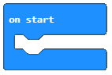

Rad sa blokovima iz kategorija Math i Variables
===============================================

MakeCode podržava četiri osnovne aritmetičke operacije:
- sabiranje ( + ),
- oduzimanje ( - ),
- množenje ( * ) i
- deljenje ( / ).

Blokovi koji omogućavaju računanje nazivaju se aritmetički operatori. Nalaze se u kategoriji |Math|.

.. |Math| image:: ../_images/_imageMicroBit/p41.png

Aritmetički operatori vraćaju **BROJ** (rezultat aritmetičke operacije).

.. image:: ../_images/_imageMicroBit/p40.png
      :align: center

Rezultat (broj) koji vraća aritmetički operator možeš da koristiš kao ulaznu vrijednost za blokove koji prihvataju brojeve. To se jasno vidi na gornjoj slici. Blok show number ... prihvata broj kao ulaz i prikazuje ga na ekranu.

Stavljamo pred tebe složeniji aritmetički izraz: ( 2 + 1 ) * ( 12 - 10 ). U MakeCode-u, izračunavanje njegovog rezultata može da izgleda ovako:

.. image:: ../_images/_imageMicroBit/p42.png
      :align: center

Analizom složenog izraza, zaključujemo da se on sastoji od manjih cjelina - međurezultata.

Zbir brojeva (2+1) je jedan međurezultat. Razlika brojeva (12-10) je drugi međurezultat. Množenjem zbira i razlike (zbir * razlika) dobijamo rezultat čitavog izraza.

U programiranju je zgodno koristiti međurezultate (međuvrijednosti), koje nazivamo i **promjenljive**. Promjenljive možeš da shvatiš kao prostore u memoriji računara, slične kutijama, u kojima se međurezultati čuvaju. Promenljive imaju svoja imena.

Kada, u programu, želiš da koristiš vrijednost promjenljive, dovoljno je da navedeš njeno ime.

U MakeCode-u, promjenljive kreiraš u kategoriji |Variables|.

.. |Variables| image:: ../_images/_imageMicroBit/p43.png

Promjenljivu kreiramo tako što, u kategoriji Variables (1), kliknemo na dugme Make a variable (Napravi promjenljivu) (2) i u polje unosimo ime promjenljive (3), u našem slučaju Brojač. Klikom na dugme OK (4).

.. image:: ../_images/_imageMicroBit/11.png
      :align: center

Jasno je da naš izraz ( 2 + 1 ) * ( 12 - 10 ) možeš da predstaviš drugačije. Stvaranjem dve promjenljive: |Zbir| i |Razlika|.

.. |Zbir| image:: ../_images/_imageMicroBit/p45.png

.. |Razlika| image:: ../_images/_imageMicroBit/p44.png

Postavljamo da je početna vrijednost promjenljive ``Brojač`` postavljena na nulu. To je moguće uraditi prevlačenjem bloka |set| iz kategorije |Variables| u blok |onstart|.

.. |set| image:: ../_images/_imageMicroBit/p47.png

Konačan izgled koda:

.. image:: ../_images/_imageMicroBit/p46.png
      :align: center

.. mchoice:: L5Z1
    :answer_a: 2.
    :answer_b: 10.
    :answer_c: 4.
    :feedback_a: Odgovor je tačan!
    :feedback_b: Nije tačan odgovor!
    :feedback_c: Nije tačan odgovor!
    :correct: a

    Napravi program koji sadrži dve promjenljive: x i y. Promjenljivoj x dodeli vrednost 2 (x = 2), a promjenljivoj yvrednost 4 (y = 4).
    Kada program izvrši blok prikazan na slici, rezultat će biti:

    .. image:: ../_images/_imageMicroBit/p48.png
          :align: center

Hajde da korištenjem aritmetičkih operatora i promjenljivih kreiramo program za izračunavanje obima i površine kvadrata.

Za izračunavanje površine kvadrata potrebno je da definišemo dimenziju stranice ``a``, čija će vrijednost da se menja nasumice, svaki put kada korisnik pritisne dugme ``A``, a kada pritisne dugme ``B`` izračunavat će se obim i površina.

Na samom početku potrebno je kreirati promjenljive ``a``, ``O`` i ``P`` koje redom predstavljaju stranicu, obim i površinu kvadrata.

Nasumična (random) promjena vrijednosti promjenljive a definisat ćemo korištenjem bloka |pickrandom|.

.. |pickrandom| image:: ../_images/_imageMicroBit/p49.png

Izgled koda kada je definisana i dodjeljena početna vrijednost promjenljive a u bloku |onbutton| :

.. |onbutton| image:: ../_images/_imageMicroBit/p18.png

.. image:: ../_images/_imageMicroBit/p50.png
      :align: center

Da bismo vidjeli koja je vrijednost dužine stranice ``a`` možemo prevući blok za prikaz |shownumber| .

.. |shownumber| image:: ../_images/_imageMicroBit/15.png

Izgled bloka:

.. image:: ../_images/_imageMicroBit/p51.png
      :align: center

Da bismo izračunali obim i površinu kvadrata moramo se podsjetiti da je obim kvadrata 4*dužina stranice (``4*a``), a da je površina proizvod dužina stranica (``a*a``). Za izračunavanje koristimo operaciju množenja. Izgled bloka za izračunavanje obima i površine kvadrata je:

.. image:: ../_images/_imageMicroBit/p52.png
      :align: center

Da bismo testirali program pokrećemo ga u simulatoru klikom na dugme |play|.

.. |play| image:: ../_images/_imageMicroBit/p3.png

.. mchoice:: L5Z2
    :answer_a: Bilo koju vrijednost iz intervala od 0 do 15 neuključujući 0..
    :answer_b: Bilo koju vrijednost iz intervala od 0 do 15 uključujući i te vrijednosti.
    :answer_c: Bilo koju vrijednost iz intervala od 0 do 15 neuključujući 15.
    :feedback_a: Nije tačan odgovor!
    :feedback_b: Odgovor je tačan!
    :feedback_c: Nije tačan odgovor!
    :correct: b

    Pažljivo proučite blok:

    .. image:: ../_images/_imageMicroBit/p53.png
          :align: center

    Koju vrijednost će imati promjenljiva Brojač kada se napravi neki pokret (shake)?
